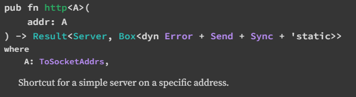
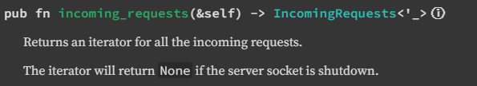

# 03 October 2023


### Apa bedanya operator "::" dan "." di Rust ?

Dalam bahasa pemrograman Rust, operator `::` dan `.` memiliki perbedaan dalam penggunaannya:

- Operator `::` digunakan ketika Anda memiliki tipe atau modul. Misalnya, Anda bisa mengakses metode statis (metode yang tidak memerlukan `self` sebagai argumen pertama) dari suatu tipe dengan menggunakan operator `::`. Contoh: `String::new()`.

- Operator `.` digunakan ketika Anda memiliki nilai di sisi kiri. Misalnya, Anda bisa mengakses metode dari suatu nilai dengan menggunakan operator `.`. Contoh: jika Anda memiliki variabel `s` yang bertipe `String`, Anda bisa memanggil metode `.len()` pada `s` dengan menggunakan `s.len()`.

Jadi, secara sederhana, operator `.` digunakan untuk mengakses anggota nilai, sedangkan operator `::` digunakan untuk mengakses anggota namespace.

Contoh anggota namespace :


Contoh anggota nilai :


### Apa bedanya `pub fn` dan `fn` pada Rust?

> TL:DR;\
`fn` hanya bisa dipanggil fungsinya di satu file .rs, tetapi dengan `pub fn` , kita bisa panggil fungsi tersebut di file .rs yang berbeda

Dalam bahasa pemrograman Rust, `fn` dan `pub fn` digunakan untuk mendefinisikan fungsi, tetapi mereka memiliki perbedaan dalam hal visibilitas:

- `fn`: Ini adalah penanda untuk fungsi. Fungsi yang didefinisikan dengan `fn` hanya dapat diakses dari dalam modul tempat fungsi tersebut didefinisikan.

- `pub fn`: Ini juga adalah penanda untuk fungsi, tetapi dengan tambahan kata kunci `pub`, fungsi tersebut menjadi publik, yang berarti fungsi tersebut dapat diakses dari kode di luar modul tempat fungsi tersebut didefinisikan.

Jadi, jika Anda ingin fungsi Anda dapat diakses dari modul lain atau dari crate lain, Anda harus menggunakan `pub fn`. Jika tidak, cukup gunakan `fn`.

### Apa itu `assert_eq!` di Rust ?

`assert_eq!` adalah sebuah makro dalam bahasa pemrograman Rust yang digunakan untuk memastikan bahwa dua ekspresi adalah sama. Makro ini menggunakan `PartialEq` untuk membandingkan kedua ekspresi.

Jika kedua ekspresi tidak sama, maka `assert_eq!` akan memicu panic dan mencetak nilai dari kedua ekspresi dengan representasi debug mereka.

Berikut adalah contoh penggunaannya:
```rust
let a = 3;
let b = 1 + 2;
assert_eq!(a, b);
```
Dalam contoh di atas, `assert_eq!` membandingkan nilai dari variabel `a` dan `b`. Karena keduanya sama, maka tidak ada yang terjadi. Namun, jika `a` dan `b` tidak sama, maka akan terjadi panic.

Makro ini juga memiliki bentuk kedua, di mana pesan panic kustom dapat disediakan. Contohnya:
```rust
let a = 3;
let b = 2 + 2;
assert_eq!(a, b, "we are testing addition with {} and {}", a, b);
```
Dalam contoh ini, jika `a` dan `b` tidak sama, maka akan terjadi panic dan mencetak pesan "we are testing addition with 3 and 4".

### Apa itu `enum` di Rust ?

Enum, atau enumerasi, adalah tipe data yang ditentukan oleh pengguna yang memungkinkan kita memilih nilai dari daftar nilai yang terkait. Dalam Rust, kita menggunakan kata kunci `enum` untuk membuat enum.

Berikut adalah contoh penggunaannya:
```rust
enum Sport {
    Basketball,
    Volleyball,
    Football,
    Cricket,
}
```
Dalam contoh di atas, kita telah membuat enum bernama `Sport` dengan daftar nilai `Basketball`, `Volleyball`, `Football`, dan `Cricket`. Nilai-nilai enum ini dikenal sebagai varian.

Enum sangat berguna ketika Anda ingin mendefinisikan tipe data yang hanya bisa memiliki satu dari beberapa kemungkinan nilai. Misalnya, alamat IP bisa berupa versi 4 atau versi 6, tetapi tidak bisa keduanya sekaligus. Oleh karena itu, enum sangat cocok untuk digunakan dalam kasus ini.

Untuk mengakses varian enum, kita perlu membuat instance dari enum tersebut¹. Misalnya:
```rust
let north = Direction::North;
let east = Direction::East;
let south = Direction::South;
let west = Direction::West;
```
Dalam contoh ini, `Direction::North` mewakili varian `North` dari enum `Direction`, dan kita menetapkannya ke variabel `north`. Demikian pula, `Direction::East`, `Direction::South`, dan `Direction::West` mewakili varian `East`, `South`, dan `West`.

### Trait di Rust

Trait dalam Rust adalah sebuah konsep yang memungkinkan kita untuk mendefinisikan perilaku yang dapat dibagi oleh berbagai jenis tipe¹²³. Trait adalah kumpulan metode yang didefinisikan untuk suatu tipe yang tidak diketahui: `Self`¹². Mereka dapat mengakses metode lain yang dideklarasikan dalam trait yang sama¹².

Trait dapat diimplementasikan untuk jenis data apa pun¹². Misalnya, kita bisa mendefinisikan trait `Animal`, yang merupakan kumpulan metode. Trait `Animal` kemudian diimplementasikan untuk tipe data `Sheep`, memungkinkan penggunaan metode dari `Animal` dengan `Sheep`¹.

Berikut adalah contoh penggunaannya:
```rust
pub trait Summary {
    fn summarize(&self) -> String;
}
```
Dalam contoh ini, kita mendeklarasikan trait menggunakan kata kunci `trait` dan kemudian nama trait, yang dalam hal ini adalah `Summary`. Di dalam kurung kurawal, kita mendeklarasikan tanda tangan metode yang menggambarkan perilaku jenis yang menerapkan trait ini, dalam hal ini adalah `fn summarize(&self) -> String`. Setelah tanda tangan metode, alih-alih memberikan implementasi dalam kurung kurawal, kita menggunakan titik koma. Setiap jenis yang menerapkan trait ini harus memberikan perilaku khususnya sendiri untuk tubuh metode².

Trait sangat mirip dengan konsep interface dalam bahasa pemrograman lain seperti Java atau kelas abstrak dalam C++³.

Sumber: Percakapan dengan Bing, 10/3/2023
(1) Traits - Rust By Example. https://doc.rust-lang.org/rust-by-example/trait.html.
(2) Traits: Defining Shared Behavior - The Rust Programming Language. https://doc.rust-lang.org/book/ch10-02-traits.html.
(3) Rust - Traits - GeeksforGeeks. https://www.geeksforgeeks.org/rust-traits/.
(4) Abstraction without overhead: traits in Rust | Rust Blog. https://blog.rust-lang.org/2015/05/11/traits.html.

### Impl di Rust

Kata kunci `impl` dalam Rust digunakan untuk mendefinisikan implementasi pada tipe¹. Ada dua jenis implementasi: implementasi inheren dan implementasi trait¹.

- Implementasi inheren adalah implementasi yang berdiri sendiri¹. Misalnya, Anda bisa mendefinisikan metode pada suatu tipe dengan menggunakan `impl`. Contoh:
```rust
struct Example {
    number: i32,
}

impl Example {
    fn boo() {
        println!("boo! Example::boo() was called!");
    }

    fn answer(&mut self) {
        self.number += 42;
    }

    fn get_number(&self) -> i32 {
        self.number
    }
}
```
Dalam contoh ini, kita mendefinisikan beberapa metode pada tipe `Example` menggunakan `impl`¹.

- Implementasi trait digunakan untuk mengimplementasikan trait pada tipe¹. Misalnya:
```rust
trait Thingy {
    fn do_thingy(&self);
}

impl Thingy for Example {
    fn do_thingy(&self) {
        println!("doing a thing! also, number is {}!", self.number);
    }
}
```
Dalam contoh ini, kita mengimplementasikan trait `Thingy` pada tipe `Example` menggunakan `impl`¹.

Penggunaan lain dari kata kunci `impl` adalah dalam sintaksis `impl Trait`, yang bisa dilihat sebagai singkatan untuk "tipe konkret yang mengimplementasikan trait ini"¹. Penggunaan utamanya adalah bekerja dengan penutupan (closures), yang memiliki definisi tipe yang dihasilkan pada waktu kompilasi yang tidak bisa hanya ditulis¹.

Sumber: Percakapan dengan Bing, 10/3/2023
(1) impl - Rust. https://doc.rust-lang.org/std/keyword.impl.html.
(2) . https://bing.com/search?q=impl+in+Rust.
(3) Implementation - Rust By Example. https://doc.rust-lang.org/rust-by-example/generics/impl.html.
(4) Implementations - The Rust Reference. https://doc.rust-lang.org/reference/items/implementations.html.
(5) undefined. https://stackoverflow.com/questions/48545035/what-does-impl-mean-when-used-as-the-argument-type-or-return-type-of-a-functio.
(6) undefined. https://blog.logrocket.com/generic-impl-blocks-rust/.


### Type dalam Rust
Dalam bahasa pemrograman Rust, kata kunci `type` digunakan untuk mendefinisikan alias untuk tipe yang ada². Alias tipe ini tidak membuat tipe baru, tetapi memberikan nama lain untuk tipe yang sudah ada². Berikut adalah contoh penggunaannya:

```rust
type Meters = u32;
type Kilograms = u32;

let m: Meters = 3;
let k: Kilograms = 3;

assert_eq!(m, k); // ini akan berhasil karena Meters dan Kilograms adalah alias untuk u32
```

Dalam contoh di atas, `Meters` dan `Kilograms` adalah alias untuk tipe `u32`. Variabel `m` dan `k` keduanya bertipe `u32`, jadi mereka bisa dibandingkan².

Selain itu, dalam trait, `type` digunakan untuk mendeklarasikan tipe terkait². Contohnya:

```rust
trait Iterator {
    type Item;

    fn next(&mut self) -> Option<Self::Item>;
}
```

Dalam contoh ini, `Item` adalah tipe terkait dalam trait `Iterator`. Tipe ini kemudian didefinisikan saat mengimplementasikan trait².

Sumber: Percakapan dengan Bing, 10/3/2023
(1) type - Rust. https://doc.rust-lang.org/std/keyword.type.html.
(2) Types - The Rust Reference. https://doc.rust-lang.org/reference/types.html.
(3) Type aliases - The Rust Reference. https://doc.rust-lang.org/reference/items/type-aliases.html.

### Struct dalam Rust

Struct, atau struktur, dalam Rust adalah tipe data khusus yang memungkinkan Anda mengelompokkan dan memberi nama pada beberapa nilai terkait¹⁷. Struct dalam Rust ada tiga jenis: Struct dengan field yang diberi nama, tuple struct, dan unit struct⁷.

Berikut adalah contoh penggunaannya:
```rust
struct User {
    active: bool,
    username: String,
    email: String,
    sign_in_count: u64,
}
```
Dalam contoh ini, kita telah membuat struct bernama `User` dengan field `active`, `username`, `email`, dan `sign_in_count`³.

Untuk menggunakan struct setelah kita mendefinisikannya, kita membuat instance dari struct tersebut dengan menentukan nilai konkret untuk setiap field³. Misalnya:
```rust
let user1 = User {
    active: true,
    username: String::from("someusername123"),
    email: String::from("someone@example.com"),
    sign_in_count: 1,
};
```
Dalam contoh ini, kita membuat instance `User` dan menetapkan nilai untuk setiap field³.

Untuk mendapatkan nilai tertentu dari struct, kita menggunakan notasi titik. Misalnya, untuk mengakses alamat email pengguna ini, kita menggunakan `user1.email`³. Jika instance tersebut dapat diubah (mutable), kita dapat mengubah nilai dengan menggunakan notasi titik dan menetapkan ke field tertentu³.

Sumber: Percakapan dengan Bing, 10/3/2023
(1) Fundamentals for using structs in Rust - LogRocket Blog. https://blog.logrocket.com/fundamentals-for-using-structs-in-rust/.
(2) undefined. https://doc.rust-lang.org/std/keyword.struct.html.
(3) Defining and Instantiating Structs - The Rust Programming Language. https://doc.rust-lang.org/book/ch05-01-defining-structs.html.
(4) . https://bing.com/search?q=struct+in+Rust.
(5) Structures - Rust By Example. https://doc.rust-lang.org/rust-by-example/custom_types/structs.html.
(6) Using Structs to Structure Related Data - The Rust Programming Language. https://doc.rust-lang.org/book/ch05-00-structs.html.
(7) Rust Struct (Structures) - Programiz. https://www.programiz.com/rust/struct.